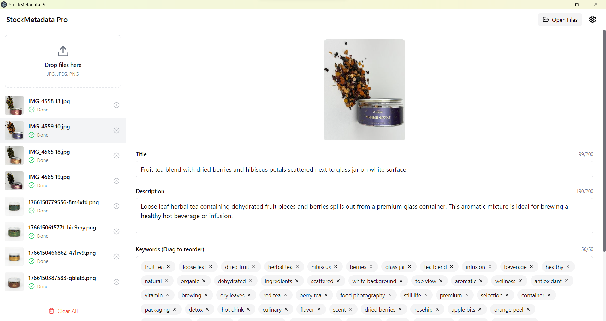

# StockMetadata Pro

🖼️ **Desktop application for automatic stock image metadata generation using AI.**

Generate optimized titles, descriptions, and keywords for your stock photography with one click.



## ✨ Features

### AI-Powered Metadata Generation
- **Title**: 50-200 characters, optimized for stock platform search
- **Description**: 100-200 characters with natural keyword integration
- **Keywords**: 40-50 relevant tags, sorted by visual relevance
- **Quality Score**: Real-time scoring (0-100) based on stock platform requirements

### Batch Processing
- Load multiple images at once (JPG, JPEG, PNG)
- **Generate All** button for sequential processing
- Progress indicator with stop functionality
- Rate limiting (500ms between requests) to prevent API overload

### Metadata Writing
- IPTC + XMP for JPEG files
- XMP for PNG files
- Automatic backup before writing

### Modern UI
- Split view layout with file list and editor
- Drag & drop file loading
- Keyword reordering with drag & drop
- Real-time character counters
- Settings modal for API configuration

## 🛠️ Tech Stack

| Category | Technology |
|----------|------------|
| Framework | Electron 33+ |
| Build Tool | electron-vite 2.3 |
| Frontend | React 18 + TypeScript 5 |
| Styling | TailwindCSS 4 |
| State | Zustand 5 |
| AI | OpenRouter API (Gemini Flash) |
| Metadata | exiftool-vendored |
| Images | sharp |

## 🚀 Getting Started

### Prerequisites
- Node.js 20+ LTS
- npm 10+
- OpenRouter API key (get one at [openrouter.ai](https://openrouter.ai))

### Installation

```bash
# Clone the repository
git clone https://github.com/ninezeroshine/StockMetadata_Pro.git
cd StockMetadata_Pro

# Install dependencies (uses .npmrc for automatic conflict resolution)
npm install

# Run in development mode
npm run dev
```

> **Note:** The project includes a `.npmrc` file that automatically handles dependency conflicts. If you still encounter issues, see [Troubleshooting](#-troubleshooting) below.

### Production Build

```bash
# Build the application
npm run build

# Preview the production build
npm run preview

# Package for distribution
npm run package:win  # Windows
npm run package:mac  # macOS
```

## 📖 Usage

1. **Configure API Key**
   - Click the ⚙️ settings icon
   - Enter your OpenRouter API key
   - Save settings

2. **Load Images**
   - Drag & drop files onto the drop zone
   - Or click "Open Files" button
   - Supported: JPG, JPEG, PNG

3. **Generate Metadata**
   - Select a file and click "Regenerate" for single file
   - Or click "Generate All" for batch processing

4. **Edit & Save**
   - Edit title, description, keywords as needed
   - Drag keywords to reorder by relevance
   - Click "Save" to write metadata to file

## 🧪 Testing

```bash
# Run unit tests
npm test

# Run tests with coverage
npm test -- --coverage
```

## 📁 Project Structure

```
src/
├── main/              # Electron main process
│   ├── services/      # OpenRouter, ExifTool, FileProcessors
│   └── utils/         # Backup utilities
├── preload/           # Context bridge API
├── renderer/          # React frontend
│   ├── components/    # UI components
│   ├── stores/        # Zustand stores
│   └── lib/           # Utilities
├── shared/            # Shared types and constants
└── tests/             # Unit tests
```

## ⚙️ Configuration

Settings are stored using `electron-store` with encrypted API key storage.

| Setting | Description | Default |
|---------|-------------|---------|
| API Key | OpenRouter API key | - |
| Model | AI model ID | google/gemini-2.0-flash-001 |
| Language | Metadata language | English |
| Backup | Create backup before writing | true |

## 🔧 Troubleshooting

### White screen on startup
If the app shows a white screen with `ERR_CONNECTION_REFUSED` errors:
1. Stop the dev server (Ctrl+C)
2. Delete the `out/` folder: `rm -rf out/` (or `rmdir /s out` on Windows)
3. Restart: `npm run dev`

### Dependency installation errors
If `npm install` fails with `ERESOLVE` errors:
```bash
npm install --legacy-peer-deps
```

### Preload script not found
If you see "Unable to load preload script" error:
1. Make sure you have `"type": "module"` in `package.json`
2. The preload path in `src/main/index.ts` should be `index.mjs` (not `.js`)

## 📝 License

MIT License - see [LICENSE](LICENSE) for details.

## 🤝 Contributing

1. Fork the repository
2. Create a feature branch (`git checkout -b feature/amazing-feature`)
3. Commit changes (`git commit -m 'Add amazing feature'`)
4. Push to branch (`git push origin feature/amazing-feature`)
5. Open a Pull Request

---

Made with ❤️ for stock photographers
